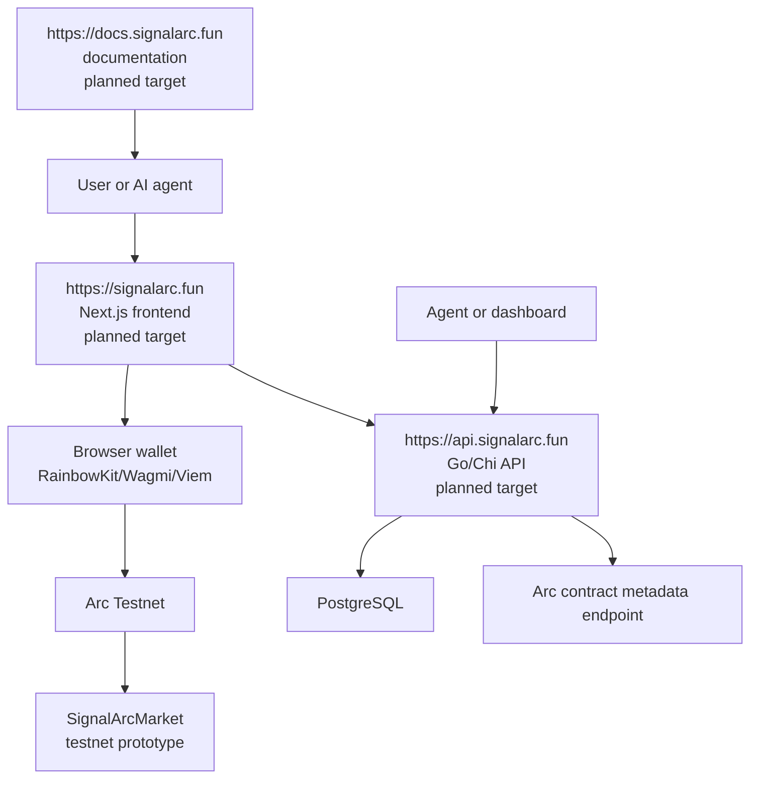
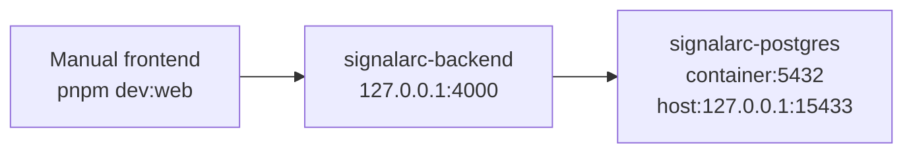

# Architecture

SignalArc is a modular monorepo for an Arc-native prediction market infrastructure platform. It separates UI, API/business logic, database state, and smart contract prototype code.

## High-Level Architecture

The public domains are planned production-facing targets. Live deployment and DNS are not completed.

## Monorepo Layout

| Path | Responsibility |
| --- | --- |
| `apps/web` | Next.js frontend, UI, wallet connection, frontend API calls, current Arc Testnet browser wallet transaction initiation. |
| `backend` | Go backend API, business logic boundaries, validation, repositories, status checks, agent-readable market API, local contract metadata endpoint. |
| `contracts` | Solidity/Foundry smart contract prototype and tests. |
| `docs` | Public documentation suite. |

## Frontend Responsibilities

- Landing and product UI.
- Market list and market detail UI.
- Market creation UI.
- Portfolio and intelligence dashboards.
- Wallet connection with RainbowKit, Wagmi, and Viem.
- API calls to the Go backend.
- Current working tree: browser wallet `approve` and `openPosition` transaction initiation on Arc Testnet.

Frontend must not hold private keys, Circle API secrets, database access, or server-side payment orchestration.

## Backend Responsibilities

- Business logic boundary.
- Market creation and validation.
- Trade-intent validation and persistence.
- Repository access for markets, positions, resolutions, settlements, and trades.
- Agent-readable market API.
- Request ID, local CORS, structured request logging, and panic recovery middleware.
- Local Arc contract metadata endpoint.

The current backend does not execute blockchain transactions.

## PostgreSQL Responsibilities

Implemented schema tables include:

- `users`
- `wallets`
- `markets`
- `positions`
- `trades`
- `liquidity`
- `resolutions`
- `settlements`
- `oracle_events`
- `audit_logs`
- `api_keys`
- `webhooks`
- `agent_access`
- `schema_migrations`

## Smart Contract Responsibilities

The `SignalArcMarket` contract prototype implements:

- USDC-like ERC20 collateral transfer into the market contract.
- YES/NO position opening.
- Market close.
- Resolver-only resolve.
- Resolver-only cancel.
- Claim after resolution.
- Refund through the same `claim()` function after cancellation.

The contract is an Arc Testnet prototype. It is not audited and is not production custody or production settlement infrastructure.

## Local Docker Architecture

Local Docker currently runs:

- `signalarc-postgres`
- `signalarc-backend`

The frontend runs manually outside Docker.

## Planned Production Architecture

| Surface | Planned Target |
| --- | --- |
| Frontend | Vercel serving `https://signalarc.fun`. |
| Backend | GCP Cloud Run container serving `https://api.signalarc.fun`. |
| Database | Managed PostgreSQL, likely GCP Cloud SQL or hosted PostgreSQL. |
| Contracts | Existing Arc Testnet prototype contract reference. Production contract deployment is not approved. |
| Docs | `https://docs.signalarc.fun` documentation target. |

Production deployment is not completed.
