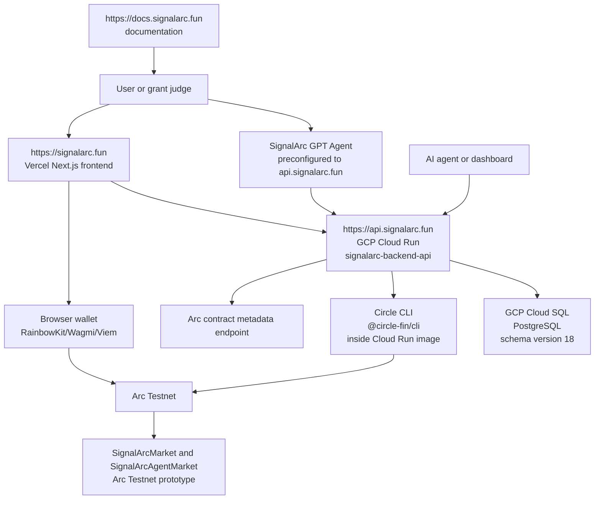
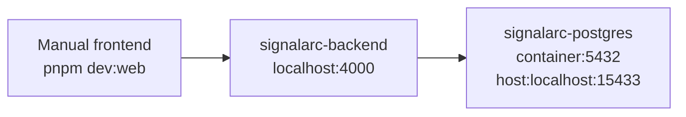

# Architecture

SignalArc is a modular monorepo for an Arc-native prediction market infrastructure platform. It separates UI, API/business logic, database state, smart contract prototype code, and agent integration.

## Live High-Level Architecture

`https://signalarc.fun` is the Vercel-hosted frontend. `https://api.signalarc.fun` is the live backend on GCP Cloud Run service `signalarc-backend-api`. The Cloud Run image bundles Node/npm and the Circle CLI (`@circle-fin/cli`) so ARC-TESTNET agent flows can run inside the container. The production database is GCP Cloud SQL, migrated to version 18.

ngrok URLs are local development conveniences only; production traffic always goes through `https://signalarc.fun` and `https://api.signalarc.fun`.

## Monorepo Layout

| Path | Responsibility |
| --- | --- |
| `apps/web` | Next.js frontend, UI, wallet connection, frontend API calls, Arc Testnet browser wallet transaction initiation. |
| `backend` | Go backend API, business logic boundaries, validation, repositories, status checks, agent endpoints (onboarding, OTP verify, session, wallet, balance, ARC-TESTNET faucet, intent preview/confirm/execute), agent-readable market API, and local contract metadata endpoint. |
| `contracts` | Solidity/Foundry smart contract prototype and tests. |
| `docs` | Public documentation suite. |
| `project-roadmap` | Maintainer-only planning notes and the Custom GPT OpenAPI schema. |

## Frontend Responsibilities

- Landing and product UI.
- Market list and market detail UI.
- Market creation UI.
- Portfolio and intelligence dashboards.
- Wallet connection with RainbowKit, Wagmi, and Viem.
- API calls to the Go backend.
- Browser wallet `approve` and `openPosition` initiation on Arc Testnet.

Frontend must not hold private keys, Circle API secrets, database access, or server-side payment orchestration.

## Backend Responsibilities

- Business logic boundary.
- Market creation and validation.
- Trade-intent validation and persistence.
- Repository access for markets, positions, resolutions, settlements, and trades.
- Agent endpoints for onboarding, OTP verify, session, wallet, balance, ARC-TESTNET faucet, and market intent lifecycle.
- Agent-readable market API.
- Request ID, CORS, structured request logging, and panic recovery middleware.
- Local Arc contract metadata endpoint.
- Calls the Circle CLI in-container for read-only Circle Agent Wallet operations and the documented testnet faucet command shape.

The backend executes Arc Testnet writes only through Circle Agent Wallet flows that target the registered agent wallet address. Mainnet writes are not implemented.

## PostgreSQL Responsibilities

Production database: GCP Cloud SQL, schema version 18.

Tables include:

- `users`
- `wallets`
- `markets`
- `positions`
- `trades`
- `liquidity`
- `resolutions`
- `settlements`
- `oracle_events`
- `audit_logs`
- `api_keys`
- `webhooks`
- `agent_access`
- `agent_wallets`
- `agent_onboarding_sessions`
- `agent_sessions`
- `schema_migrations`

Secrets such as Circle session material, OTPs, and request IDs are never stored.

## Smart Contract Responsibilities

The `SignalArcMarket` contract prototype implements:

- USDC-like ERC20 collateral transfer into the market contract.
- YES/NO position opening.
- Market close.
- Resolver-only resolve.
- Resolver-only cancel.
- Claim after resolution.
- Refund through the same `claim()` function after cancellation.

The `SignalArcAgentMarket` and `SignalArcAgentMarketFactory` contracts support agent-driven market creation and lifecycle on Arc Testnet, called through the Circle Agent Wallet provider.

The contracts are Arc Testnet prototypes. They are not audited and are not production custody or production settlement infrastructure.

## Local Docker Architecture

Local Docker currently runs:

- `signalarc-postgres`
- `signalarc-backend`

The frontend runs manually outside Docker. Local-only conveniences such as ngrok tunnels are not used in production.

## Live Production Architecture

| Surface | Live Target |
| --- | --- |
| Frontend | Vercel serving `https://signalarc.fun`. |
| Backend | GCP Cloud Run service `signalarc-backend-api` serving `https://api.signalarc.fun`. |
| Database | GCP Cloud SQL PostgreSQL, schema version 18. |
| Backend container image | Includes `signalarc-api` and the global Circle CLI (`@circle-fin/cli`) on `PATH`. |
| Contracts | `SignalArcMarket`, `SignalArcAgentMarket`, and `SignalArcAgentMarketFactory` deployed on Arc Testnet only. Production deployment is not approved. |
| Docs | `https://docs.signalarc.fun` documentation target. |

## Out of Scope

- Arc mainnet deployment.
- Production custody, production settlement approval, or audit claim.
- Arbitrary transfer, withdraw/deposit, agent logout/session-management endpoints, and mainnet funding actions.
